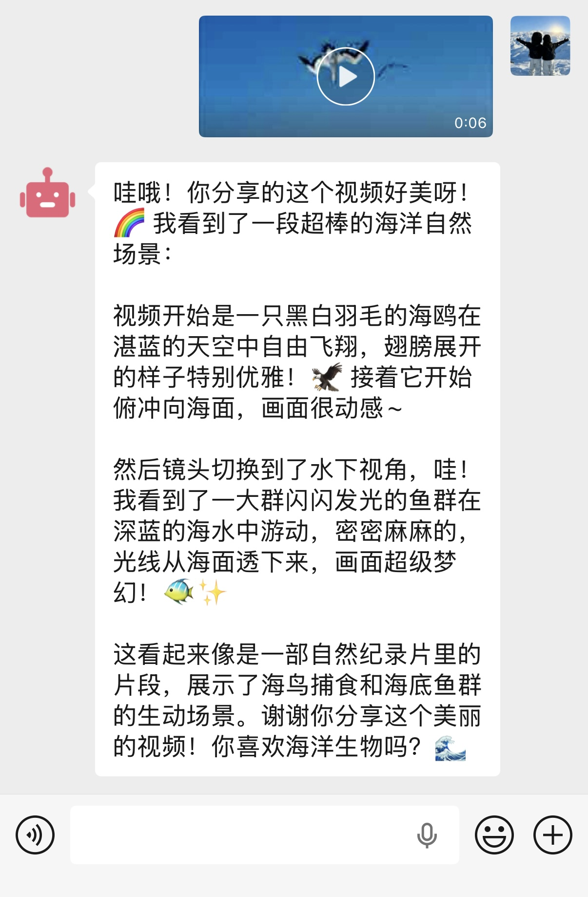
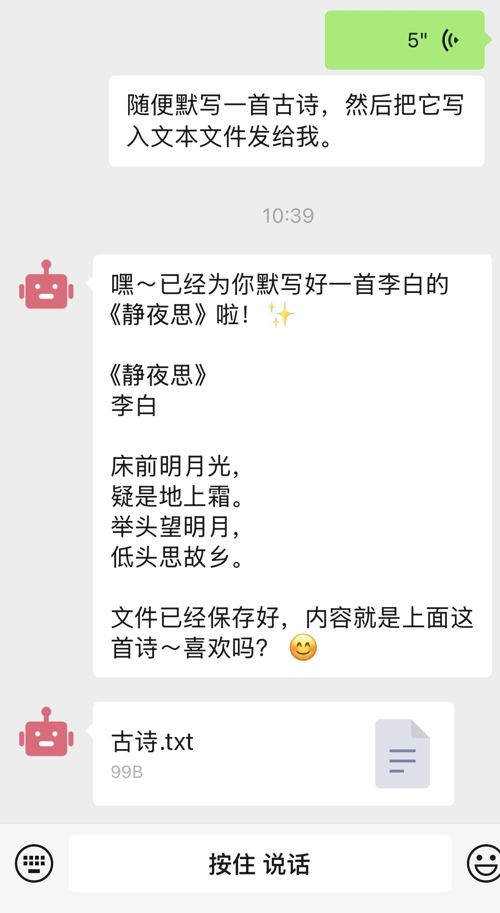

<h1 align="center">
  <br>
  
</h1>

<h4 align="center">一个侧重隐私安全，基于opencode的微信接入框架和学习模板，适配文本、语音、图片、表情包、视频和位置消息接收，文本和文件消息推送。</h4>
      
<p align="center">
  <a href="#模板特点">模板特点</a> •
  <a href="#快速构建">快速构建</a> •
  <a href="#本地模型">本地模型</a> •
  <a href="#隐私配置">隐私配置</a> •
  <a href="#长期记忆">长期记忆</a> •
  <a href="#效果展示">效果展示</a> •
  <a href="#免责声明">免责声明</a> •
  <a href="#参考链接">参考链接</a>
</p>

---

这不是一个完整且新颖的`Supervisior`应用框架，只是一个考虑了隐私安全以及梳理链路数据流转，适配opencode的微信学习模板，或者说是一篇学习记录文档，主要用于记录、研究与学习，若需熟悉数据流转和高度自定义，可能有帮助和参考意义
> openclaw太庞大，限制和权限一是担忧的问题；其他claw精细化配置复杂，生态和能力无法满足需求。
opencode兼顾开源、原子性、生态和能力，是一个平衡的解决方案，但其接入微信与本地模型的插件、文档较为零散。
因此本项目对相关内容进行了整理，期望提供可复用的适配代码，充分利用opencode的原子能力打造属于自身的`Supervisior Agent`。

## 模板特点

- 划分隐私bot（`self`）和生产力bot（`bot`），隔离规则、skills和存储等数据
    - 隐私bot不出内外网，只开放本地模型调用路由，适合强隐私敏感数据场景
    - 生产力bot不出内网（防止内网探测），可访问外网，适合需要外网资源的生产力场景
- opencode运行时环境在独立的容器中（可替换其他沙箱），单次推理结束后容器销毁，每次通过映射会话、规则和skills等数据，确保最小权限`只读`映射原则，保证隐私安全的同时实现会话短期记忆
- 支持输入：文本、语音、图片、表情包、视频和位置消息；支持输出：文本和文件推送
    - 图片：多模态模型直接处理
    - 视频：关键帧图片处理，目前版本opencode（`v1.3.0`）主分支未合入支持多模态的视频输入[https://github.com/anomalyco/opencode/pull/18005](https://github.com/anomalyco/opencode/pull/18005)
- 规则文件适配针对不同请求身份（user_id）的不同处理和回复逻辑
- 提供向量化长期记忆的可复用代码

## 快速构建

1. 配置`config.py`，根据实际情况和注释修改
2. 配置`opencode.json`，配置自身的本地模型地址和其他opencode自定义参数
3. 配置`prompt`规则目录下的规则文件，根据实际情况修改
4. `iptables.sh`中对网络进行了限制，默认只打开了本地模型路由放行，可根据自身实际情况和模型地址修改
```bash
sudo iptables -A DOCKER-USER -d `本地模型API IP` -p tcp --dport `本地模型API 端口` -j ACCEPT
```
5. 企业微信管理后台自建应用可信IP添加自身服务器IP
6. 构建或拉取`Dockerfile`镜像
```bash
# 直接拉取镜像
docker pull tdragon6/opencode:latest

# OR 本地构建镜像
docker build -t opencode .
```
7. 运行`./main.sh`即可在微信中操作你的bot


## 本地模型
- 快捷部署可以直接使用`lm studio`，自带仓库一键下载模型，自带vulkan显卡加速（amd/nvidia/apple通用）
- 实测Qwen3.5多模态模型效果良好（本地测试使用`Qwen3.5 9B Q8_0`）
- opencode免费模型`opencode/mimo-v2-omni-free`支持多模态输入，效果实测良好


## 隐私配置
- `opencode.json`中建议配置`"share": "disabled"`，环境变量中传递`OPENCODE_AUTO_SHARE=false`禁用分享功能
- opencode话标题生成可能会用opencode的`small_model`，如果想完全注重隐私，建议配置`opencode.json`的`"disabled_providers": ["opencode"]`
- opencode在断网环境下无法启动问题
    - opencode启动默认会拉取[https://models.dev/api.json](https://models.dev/api.json)中的模型信息，通过传递环境变量`OPENCODE_DISABLE_MODELS_FETCH=true`关闭
    - opencode启动联网检查更新，可通过传递环境变量`OPENCODE_DISABLE_AUTOUPDATE=true`关闭
    - opencode启动使用bun强制覆盖安装插件，可通过传递环境变量`OPENCODE_DISABLE_DEFAULT_PLUGINS=true`关闭，也可以用类似`Dockerfile`中的方法，构建的最后一步`opencode stats`，在互联网环境下先让opencode初始化


## 长期记忆
- 基于向量化
  - 以向量化存储和检索长期记忆及知识库，初测效果良好，未深入使用，因此未接入框架模板，`embed`目录提供可复用的向量化嵌入和检索代码
  - 向量化模型测试时使用本地`text-embedding-kalm-embedding-gemma3-12b-2511`模型部署
  - 优点：不用考虑存储量级、检索速度快；缺点：缺乏上下文语义，依赖分词结构
- 基于模型推理
  - 参考 [https://github.com/VectifyAI/PageIndex](https://github.com/VectifyAI/PageIndex) 思路，生成文件树代码开源，但检索好像没找到开源的代码，检索原理类似skills的渐进式加载和推理
  - 优点：包含完整上下文语义；缺点：检索慢，费token


## 效果展示
<table>
  <tr>
    <td width="33%" valign="top">
      <h4>图片/表情包输入</h4>
      
    </td>
    <td width="33%" valign="top">
      <h4>视频输入</h4>
      
    </td>
    <td width="33%" valign="top">
      <h4>语音输入+工具调用+文件推送</h4>
      
    </td>
  </tr>
</table>


## 免责声明
本程序仅面向合法的用户，在使用本程序前，您应确保该行为符合当地的法律法规

若您在使用本程序的过程中存在任何非法行为，您需自行承担相应后果，作者将不承担任何法律及连带责任。

本程序不是生产级项目，只做框架模板学习和研究，可能存在功能、性能和安全方面的漏洞，由此产生的任何问题作者将不承担任何责任。

在使用本程序前，请您务必审慎阅读、充分理解各条款内容、免责声明、使用文档和LICENSE。除非您已充分阅读、完全理解并接受本协议所有条款，否则，请您不要使用本程序。您的使用行为或者您以其他任何明示或者默示方式表示接受本协议的，即视为您已阅读并同意本协议的约束。


## 参考链接
- **企业微信消息接收与发送 官方文档：**[https://developer.work.weixin.qq.com/document/path/90235](https://developer.work.weixin.qq.com/document/path/90235)
- **腾讯云ASR 官方文档：**[https://cloud.tencent.com/document/product/1093/35646](https://cloud.tencent.com/document/product/1093/35646)
- **自建企业微信应用 参考文档：**[https://damodev.csdn.net/6994568a0a2f6a37c592362b.html](https://damodev.csdn.net/6994568a0a2f6a37c592362b.html)
- **opencode 官方文档：**[https://opencode.ai/docs](https://opencode.ai/docs)
- **Agent/Harness学习推荐项目：**[https://github.com/shareAI-lab/learn-claude-code](https://github.com/shareAI-lab/learn-claude-code) 


## LICENSE
- 本项目使用 [MIT License](https://github.com/tdragon6/weAgentSlim/blob/main/LICENSE)
- 第三方依赖的许可证信息详见：[THIRD_PARTY_LICENSES.md](THIRD_PARTY_LICENSES.md)。
